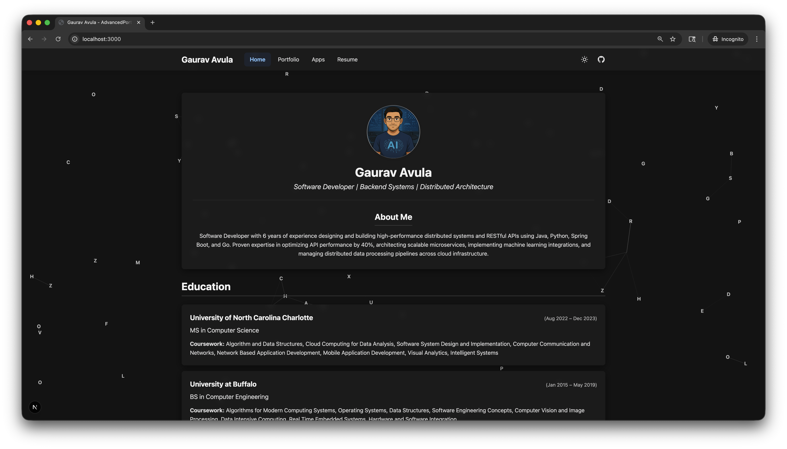
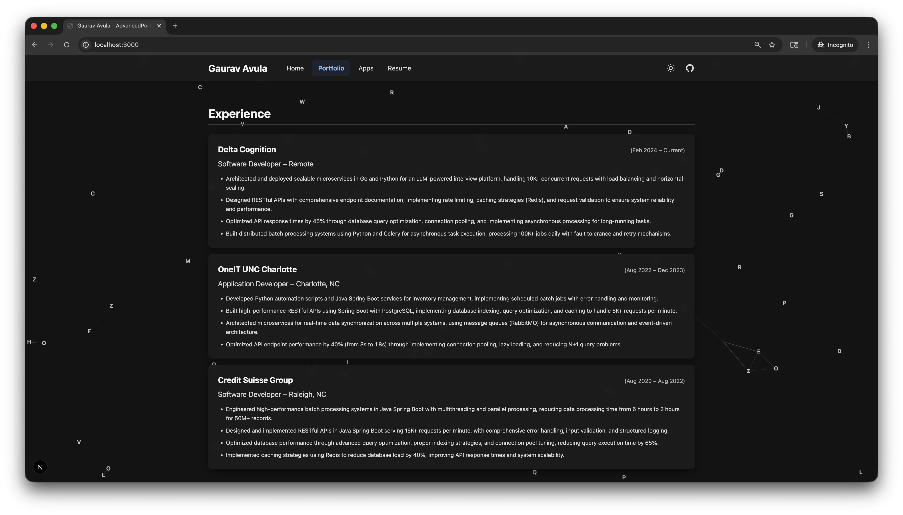
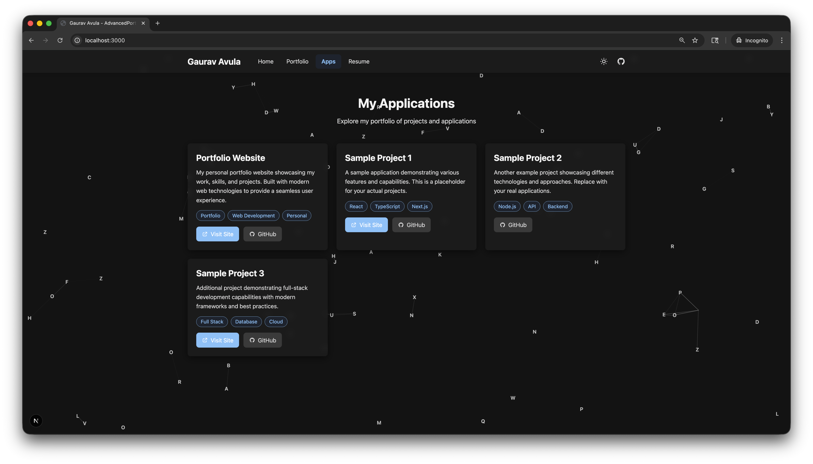
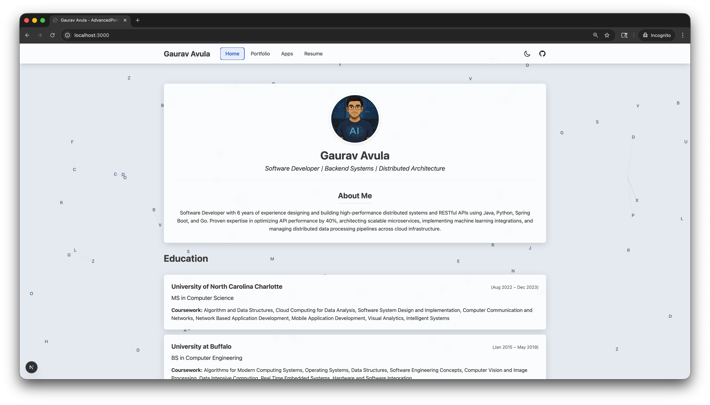

# AdvancedPortfolio

An advanced, interactive portfolio application built with Next.js featuring animated backgrounds, multiple sections, and a modern design. Showcases professional experience, skills, projects, applications, and resume with a beautiful animated grid background.


## 📸 Screenshots

### Home Page (Dark Mode)

*Interactive animated grid background with professional profile, education, skills, and contact information.*

### Portfolio Page

*Comprehensive work experience and personal projects showcase with detailed achievements.*

### Apps Page

*Application cards displaying project links, descriptions, and technology tags.*

### Home Page (Light Mode)

*Clean light theme with excellent contrast and readability.*

## 🌟 Features

### Visual Effects
- **Animated Grid Background**: Interactive background with moving letters (A-Z) and connecting lines
- **Mouse-following Lines**: Lines connect to your cursor as you move across the screen
- **Smooth Transitions**: Fade-in animations when switching between sections
- **Light/Dark Theme**: Toggle between light and dark modes with smooth transitions
- **Semi-transparent Cards**: Glass-morphism effect with backdrop blur

### Sections
1. **Home** - Professional profile with photo, about me, education, skills, and contact
2. **Portfolio** - Work experience and personal projects
3. **Apps** - Application showcase with cards, links, and tags
4. **Resume** - Embedded PDF viewer with download option

### Interactive Features
- **Email Modal**: Smart contact system with location permission request
- **Theme Toggle**: Persistent theme preference saved to localStorage
- **Responsive Navigation**: Tab-based navigation with active state highlighting
- **Hover Effects**: Interactive feedback on all clickable elements

### Mobile Responsive
- Fully responsive design for all screen sizes
- Optimized layouts for mobile, tablet, and desktop
- Touch-friendly interactions
- Adaptive font sizes and spacing

## 🚀 Getting Started

### Prerequisites
- Node.js 18.x or higher
- npm or yarn package manager

### Installation

1. **Clone the repository**
   ```bash
   git clone <repository-url>
   cd AdvancedPortfolio
   ```

2. **Install dependencies**
   ```bash
   npm install
   ```

3. **Run the development server**
   ```bash
   npm run dev
   ```

4. **Open your browser**
   Navigate to [http://localhost:3000](http://localhost:3000)

## 📁 Project Structure

```
AdvancedPortfolio/
├── app/
│   ├── components/
│   │   ├── GridBackground.tsx    # Animated background component
│   │   ├── Navbar.tsx             # Navigation bar with theme toggle
│   │   ├── AppCard.tsx            # Application card component
│   │   ├── EmailModal.tsx         # Contact modal with location
│   │   ├── PortfolioHome.tsx      # Home section content
│   │   ├── PortfolioProjects.tsx  # Portfolio section content
│   │   └── ResumeSection.tsx      # Resume viewer component
│   ├── layout.tsx                 # Root layout with context
│   ├── page.tsx                   # Main page with section routing
│   └── globals.css                # Global styles and animations
├── public/
│   ├── screenshots/               # Application screenshots
│   │   ├── 1.png                  # Home page (dark mode)
│   │   ├── 2.png                  # Portfolio page
│   │   ├── 3.png                  # Apps page
│   │   └── 4.png                  # Home page (light mode)
│   ├── profile.png                # Profile photo
│   └── resume.pdf                 # Resume PDF
├── package.json
├── tsconfig.json
├── tailwind.config.ts
├── postcss.config.mjs
└── README.md
```

## 🎨 Customization

### Update Personal Information

1. **Profile Photo**: Replace `public/profile.png` with your photo
2. **Resume**: Replace `public/resume.pdf` with your resume
3. **Portfolio Content**: Edit `app/components/PortfolioHome.tsx` and `app/components/PortfolioProjects.tsx`
4. **Applications**: Edit the `applications` array in `app/page.tsx`

### Modify Theme Colors

Edit the CSS variables in `app/globals.css`:

```css
:root {
  --bg-color: #e8edf2;              /* Light theme background */
  --content-bg-color: rgba(255, 255, 255, 0.85);  /* Card background */
  --link-color: #1976D2;             /* Accent color */
  /* ... more variables */
}
```

### Add Applications

In `app/page.tsx`, add to the `applications` array:

```typescript
{
  title: "Your App Name",
  description: "Your app description",
  websiteUrl: "https://your-site.com",
  githubUrl: "https://github.com/your-repo",
  tags: ["React", "TypeScript", "Next.js"]
}
```

## 🛠️ Tech Stack

- **Framework**: Next.js 16.0 (App Router)
- **UI Library**: React 19.2
- **Language**: TypeScript 5.9
- **Styling**: Tailwind CSS 4.1
- **Animations**: CSS Animations & Transitions
- **Icons**: Inline SVG

## 📱 Responsive Breakpoints

- **Mobile**: < 768px
- **Tablet**: 768px - 1024px
- **Desktop**: > 1024px

## 🔧 Available Scripts

```bash
npm run dev      # Start development server
npm run build    # Create production build
npm start        # Start production server
npm run lint     # Run ESLint
```

## 🌐 Deployment

### Build for Production

```bash
npm run build
```

### Deploy to Vercel

1. Push your code to GitHub
2. Import the repository in [Vercel](https://vercel.com)
3. Vercel will automatically detect Next.js and deploy

### Deploy to Other Platforms

The application can be deployed to any platform that supports Next.js:
- Netlify
- AWS Amplify
- Railway
- Render

## 🎯 Key Features Explained

### Animated Grid Background
- 35-80 animated letter nodes (responsive to screen size)
- Lines connect nodes within 100px radius
- Mouse interaction creates dynamic connections
- Smooth performance with `requestAnimationFrame`

### Theme System
- Uses CSS variables for theming
- Persists preference to localStorage
- Smooth color transitions
- System preference detection

### Email Contact System
- Location permission request
- 10-second countdown timer
- Opens default email client
- Fallback for denied permissions

### Resume Viewer
- Embedded PDF viewer
- Download button
- Fallback for unsupported browsers
- Mobile-optimized height

## 📄 License

This project is open source and available under the MIT License - see the [LICENSE](https://github.com/gauravav/Advanced-Portfolio/blob/main/LICENSE) file for details.

## 👤 Author

**Gaurav Avula**
- Website: [gauravavula.com](https://gauravavula.com)
- LinkedIn: [linkedin.com/in/gauravavula](https://linkedin.com/in/gauravavula)
- GitHub: [@gauravav](https://github.com/gauravav)

## 🤝 Contributing

Contributions, issues, and feature requests are welcome!

## 📝 Notes

- The animated background may impact performance on low-end devices
- PDF embedding works best in modern browsers (Chrome, Firefox, Safari, Edge)
- Location permission is optional and only used if granted

## 🔮 Future Enhancements

- [ ] Blog section
- [ ] Project filtering and search
- [ ] Analytics integration
- [ ] Multi-language support
- [ ] More animation options
- [ ] Contact form backend integration

---

Made with ❤️ using Next.js and React
